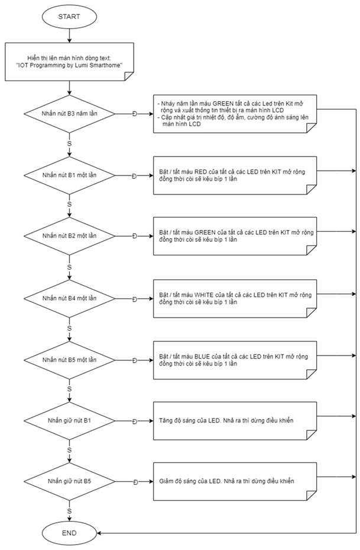

# 🚀 Smart Touch Switch Simulator (STM32F401RE)

## 📌 Giới thiệu

Dự án xây dựng hệ thống mô phỏng công tắc cảm ứng cho nhà thông minh trên nền tảng vi điều khiển **STM32F401RE (Nucleo)**.

Firmware được thiết kế theo kiến trúc **hướng sự kiện (Event-driven)**, kết hợp **State Machine** và cấu trúc **module hóa**, giúp hệ thống dễ mở rộng và bảo trì.

Hệ thống xử lý tương tác từ nút nhấn để điều khiển LED RGB, còi buzzer, hiển thị LCD và cập nhật dữ liệu cảm biến môi trường theo chu kỳ.

---

## 🔧 Chức năng chính

### 1️⃣ Hiển thị khởi động
- Hiển thị thông báo hệ thống trên LCD khi cấp nguồn.

### 2️⃣ Xử lý nút nhấn
- Nhấn đơn: bật/tắt các màu LED RGB (Red, Green, Blue, White).
- Phát tín hiệu buzzer khi có thao tác.
- Nhấn 5 lần liên tiếp: hiển thị thông tin hệ thống.
- Nhấn giữ: tăng/giảm độ sáng LED bằng điều khiển PWM.

### 3️⃣ Đọc dữ liệu cảm biến
- Nhiệt độ & độ ẩm qua giao tiếp **I2C**.
- Cường độ ánh sáng qua **ADC (DMA mode)**.
- Cập nhật dữ liệu định kỳ bằng **Timer scheduling**.

---

## 🏗 Kiến trúc phần mềm

- Thiết kế theo mô hình **Event-driven**
- Xây dựng **State Machine** (Startup / Idle / Reset)
- Sử dụng **Timer Scheduler** cho tác vụ định kỳ
- Cấu trúc mã nguồn dạng module:
  /Core
  /Drivers
  /Application
  
---

## 🛠 Công nghệ sử dụng

- MCU: **STM32F401RE**
- Ngôn ngữ: **Embedded C**
- GPIO – Xử lý nút nhấn
- PWM – Điều khiển độ sáng LED RGB
- SPI – Giao tiếp LCD
- I2C – Cảm biến nhiệt độ & độ ẩm
- ADC + DMA – Cảm biến ánh sáng

---

## 📊 Luồng hoạt động hệ thống

1. Khởi tạo hệ thống
2. Hiển thị thông báo khởi động
3. Chuyển sang trạng thái chờ
4. Xử lý sự kiện (Button / Timer / Sensor)
5. Điều khiển LED, buzzer và cập nhật LCD

---

## 🖼 Sơ đồ chương trình

